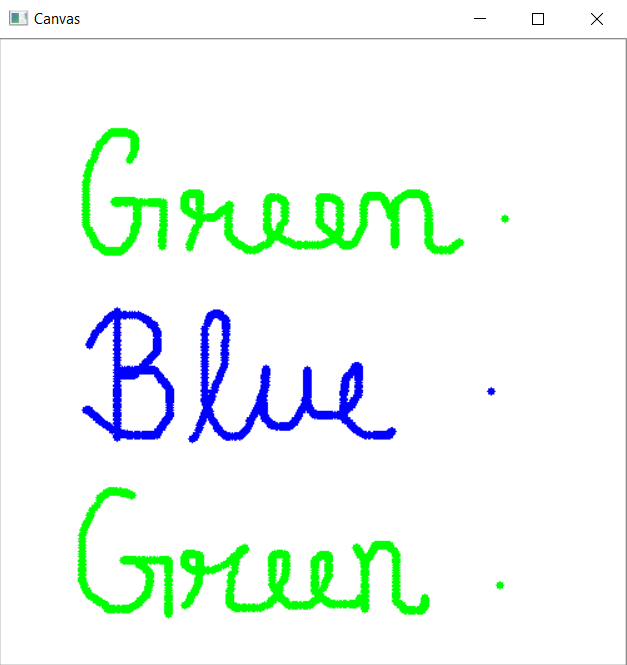
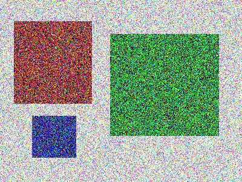
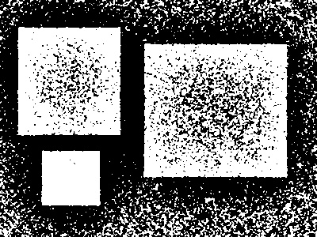
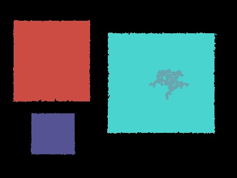
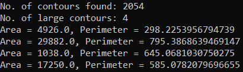
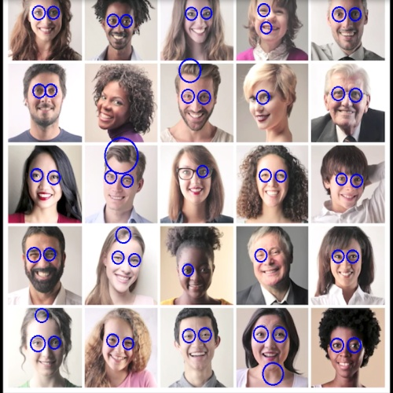
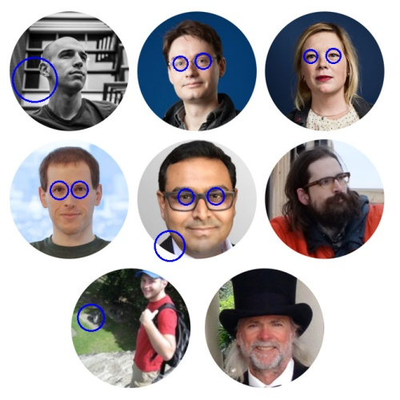

# OpenCV-for-Python-Developers
This course had the following learning outcomes:
* Detailed introduction to OpenCV 3
* Data and Image Types
* Manipulating pixels and images
* Read video streams as input and create custom real-time video interfaces
* Object, Facial and Feature Detection
* Template Matching and ML to identify and recognize features

The course had three challenge assignments.

## Challenge 1: A Simple Drawing App
Task: Create a drawing app,
* Able to paint multiple circles on a white canvas
* Able to select between atleast 2 different colors
* Press 'q' to exit
* Press 'b' to change color to blue and 'g' to change color to green
#### Drawing Canvas

## Challenge 2: Assign Object IDs and Attributes
Task: Input is a fuzzy image
* For all objects in the fuzzy image, segment them out, draw them on a blank image, and print the perimeter and area
* Only draw large objects (area of greater than 1000 px2)
* Each object should be drawn with its own color (it does not need to match the source image color)
* TIP: Consider smoothing the image before segmenting

#### Original Fuzzy Image

#### Binary                                         |  Contours
    

#### IDs and Attributes

## Challenge 3: Eye Detection
* Create a script which draws circles around all eyes in an image
* Utilize the Haar Cascade method, leveraging the pretrained haarcascade_eye.xml file provided
* Try to reduce the number of false positives and false negatives as much as possible
* False positive - Drawing a circle where there isn't an eye
* False negative - Not drawing a circle where there is an eye

#### Eye Detection on Face Grids
    

**Note:** The performance of eye detection is proportional to the training of the model, hence false positives and negatives can be seen in the result. The result can be improved through better learning.
